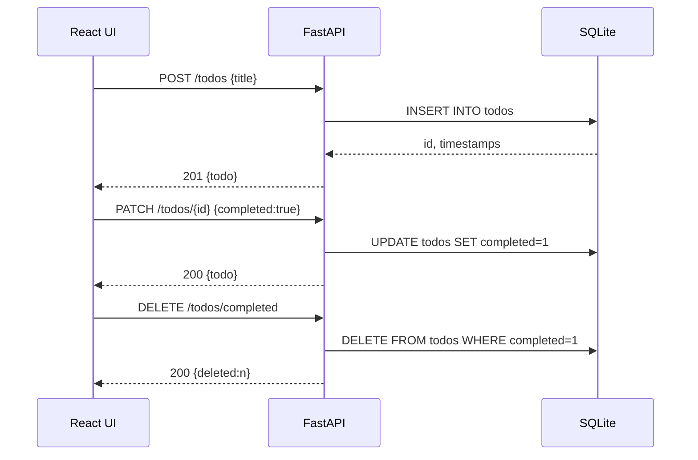

# 技术架构说明（TECH_ARCHITECTURE.md）

本文件依据 `todo-app/req.md` 的需求，给出实现一个待办事项应用（React + FastAPI + SQLite）的技术方案、数据库设计（含 SQL）、API 接口规范，以及前后端目录结构与关键实现要点。

## 总览
- 前端：React（无打包器方案，使用 CDN + Babel Standalone，便于快速启动），纯静态资源方式部署与调试。
- 后端：FastAPI（Python 3.10+），使用 SQLAlchemy 2.x 访问 SQLite。
- 数据库：SQLite（本地文件 `todo.db`）。
- 目录结构：
  - `todo-app/`
    - `req.md`（需求）
    - `TECH_ARCHITECTURE.md`（本文档）
    - `backend/`（FastAPI 服务端）
    - `front/`（React 静态前端）

## 目标功能（与需求对齐）
- 标题、输入框、添加按钮、待办列表展示。
- 添加待办：从输入框读取文本，创建待办项，清空输入框。
- 标记完成：为列表项新增 `completed` CSS 类，实现划线等视觉效果。
- 删除待办：从列表移除。
- 过滤：全部/未完成/已完成。
- 清除已完成、清除全部。

## 技术要求对照
- 前端：React
- 后端：FastAPI
- 数据库：SQLite
- 项目分为 `backend` 与 `front` 两个目录。

## 后端技术方案
- 框架：FastAPI
- 运行：`uvicorn app.main:app --reload`（开发模式）
- 依赖：
  - fastapi, uvicorn
  - pydantic (v2)
  - sqlalchemy (2.x)
  - pytest（测试）
  - httpx（测试用）
- 中间件：CORS（允许前端 http://127.0.0.1:8000 之外的本地静态页面访问）。
- 分层：
  - `app/database.py`：数据库引擎、会话、Base。
  - `app/models.py`：SQLAlchemy ORM 模型。
  - `app/schemas.py`：Pydantic 模型（请求/响应）。
  - `app/crud.py`：数据访问与业务操作。
  - `app/main.py`：FastAPI 启动、路由、依赖注入、CORS、表自动创建。

## 数据库设计
- 表：`todos`
- 字段：
  - `id` INTEGER PRIMARY KEY AUTOINCREMENT
  - `title` TEXT NOT NULL
  - `completed` INTEGER NOT NULL DEFAULT 0  （0/1 表示 false/true）
  - `created_at` DATETIME NOT NULL DEFAULT CURRENT_TIMESTAMP
  - `updated_at` DATETIME NOT NULL DEFAULT CURRENT_TIMESTAMP

### 建表 SQL
```sql
CREATE TABLE IF NOT EXISTS todos (
  id INTEGER PRIMARY KEY AUTOINCREMENT,
  title TEXT NOT NULL,
  completed INTEGER NOT NULL DEFAULT 0,
  created_at DATETIME NOT NULL DEFAULT (datetime('now')),
  updated_at DATETIME NOT NULL DEFAULT (datetime('now'))
);
```

> 实际实现中使用 SQLAlchemy ORM 自动建表（`Base.metadata.create_all(engine)`），以保持与模型一致。

## API 设计
所有返回值均为 `application/json`。

- 资源模型 Todo（响应体）：
```json
{
  "id": 1,
  "title": "学习 FastAPI",
  "completed": false,
  "created_at": "2025-10-08T09:00:00",
  "updated_at": "2025-10-08T09:00:00"
}
```

- 创建 Todo
  - 方法/路径：POST `/todos`
  - 请求体：
    ```json
    { "title": "任务标题" }
    ```
  - 响应：201 + Todo

- 获取 Todo 列表
  - 方法/路径：GET `/todos`
  - 查询参数：`status` 可选，取值 `all`（默认）/`active`/`completed`
  - 响应：200 + Todo[]

- 更新 Todo（部分更新）
  - 方法/路径：PATCH `/todos/{id}`
  - 请求体（任意字段可选）：
    ```json
    { "title": "新标题", "completed": true }
    ```
  - 响应：200 + Todo

- 切换完成状态（便捷端点）
  - 方法/路径：POST `/todos/{id}/toggle`
  - 响应：200 + Todo

- 删除单个 Todo
  - 方法/路径：DELETE `/todos/{id}`
  - 响应：204（无内容）

- 清除已完成
  - 方法/路径：DELETE `/todos/completed`
  - 响应：200
  - 响应体：
    ```json
    { "deleted": 3 }
    ```

- 清除全部
  - 方法/路径：DELETE `/todos`
  - 响应：200
  - 响应体：
    ```json
    { "deleted": 10 }
    ```

### 错误规范
- 404：资源未找到。
- 422：参数校验失败。
- 500：服务器内部错误（应避免，记录日志）。

## 前端技术方案
- 直接使用 React + ReactDOM + Babel Standalone（CDN）。
- 使用原生 `fetch` 调用后端 API。
- 单页面应用，主要组件：
  - `App`：包含输入框、过滤器、列表与按钮。
  - `TodoItem`：单项展示，提供完成和删除操作。
- 状态：
  - `todos`（从后端加载）
  - `filter`：`all`/`active`/`completed`
- 交互策略：
  - 每次变更后增量更新前端状态，并适时调用对应 API。
  - 过滤操作优先请求后端的筛选接口（也可本地过滤）。

## 样式规范（关键点）
- 主体容器居中，最大宽度 800px。
- 输入框与按钮具备 hover/active 反馈。
- 列表项之间留有间距。
- `.completed` 类名用于划线、置灰。

## 测试方案
- 使用 `pytest` + FastAPI `TestClient` 进行接口测试：
  - 创建、查询、更新、删除、筛选、清除已完成、清除全部的链路用例。
- 测试前清理数据（调用清除全部端点）。

## 运行与部署建议
- 后端：`uvicorn app.main:app --reload --port 8000`
- 前端：任何静态服务器（或 VSCode Live Server）打开 `front/index.html`。
- CORS：后端已放开本地静态页访问；若需要限制，请将 `allow_origins` 配置为具体来源。

## 时序示意（添加->完成->清除已完成）

